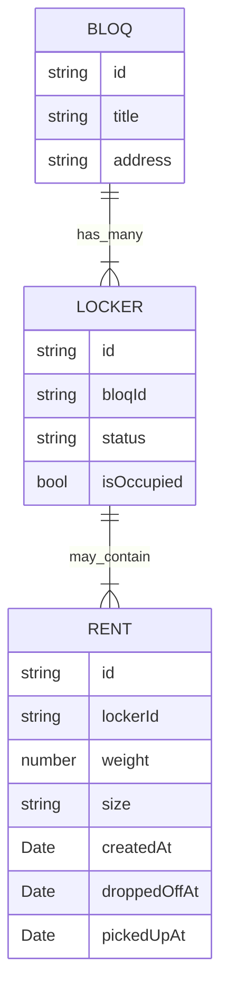

# Software Engineering Challenge, by Bloqit

Yesterday morning, when we showed up to work at 9ish, we noticed that all our codebases suddenly **disappeared** (yes, including the "serverless" stuff) and, to make matters worse, all our staff had a strong and collective case of amnesia (which, funny enough, only extends to the work-related subjects). Our CTO Ricardo, though, still has some flashes of our domain model. He vaguely remembers that we had a thing called `Bloq`, which each contained many `Lockers` (doors), which, in turn, could contain a thing called `Rent` (parcel) from time to time. After this short description, our engineering team also started to have some memory flashes and managed to put together some basic properties of each entity:

```graphql
enum RentStatus {
  CREATED
  WAITING_DROPOFF
  WAITING_PICKUP
  DELIVERED
}

enum RentSize {
  XS
  S
  M
  L
  XL
}

type Rent {
  id: String
  lockerId: string
  weight: number
  size: RentSize
  status: RentStatus
}

enum LockerStatus {
  OPEN
  CLOSED
}

type Locker {
  id: String
  bloqId: String
  status: LockerStatus
  isOccupied: bool
}

type Bloq {
  id: String
  title: String
  address: String
}
```

The engineering team also found it useful to capture the aforementioned relationships into an entity-relationship diagram, resulting in the depiction below:



When they headed off to start coding this all over again, though, they realized that **they can't code!!!**. Thankfully we have you, dear candidate, to implement our API from scratch all over again 🙌🏽

## The challenge

Based on the description above, you're now tasked to implement an initial version of our API, containing the three aforementioned entities represented as API resources. We count on you to help us come back on facilitating first, middle, and last mile delivery as soon as possible!

Ah, before we forget (again), we've also found some JSON files that seem to be from collections related to the entities mentioned above, please use that as our database (they're located at [/data](./data)).

## What we will be analyzing

**Code cohesion, quality, clearness, and correctness**

We value clean code that works and that follows industry-wide standards. Be ready to bring your best programming skills to the table

**Test coverage**

The "that works" part in the topic above cannot be expressed with 100% certainty unless we have good test coverage. Feel free to include some while implementing your solution.

**Codebase organization, modularization, and coupling**

In such a dynamic and fast-paced environment like ours, we always keep an eye out for scalability and also for eventual strategic swings and changes of priority in our product offerings. In a scenario like that, good modularization and low coupling are two critical aspects that allow us to move fast without breaking things

**Engineering principles and practices**

Sometimes it's good to know the theoretical principles behind certain practices, feel free to bring some of the patterns you may judge necessary when implementing the solution
